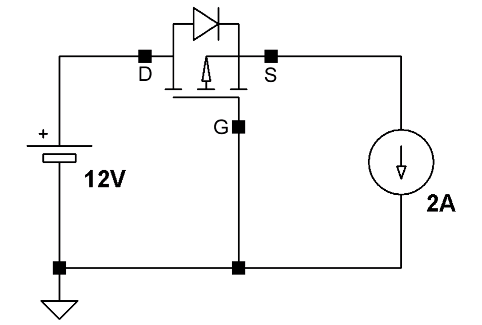

# 英语学习
## 扇贝单词
- deplore dispatch detective decriminate despoil 
- heed nourish refurbish ingredient confine 
- expedition expend
> dispatch   : send to a particular destination 
> heed       : pay attention to  
> cofine     : pervent it from  
> expedition : organized journey that is made for a particular purpose 
> verbiage   : too many words to make speech difficult to understand  
> frugal     : not expensive 
> assassinate: murder as a political act 
> ambivalent : uncertain  
> conspicuous: can be noticed easily 
> contender  : someone who takes part in a competition 
> picturesque: attractive 
> rug        : carpet covers a smaller area 
> collaborate: work together 
> satiric    : ironic 
## [TuesMagique](https://mp.weixin.qq.com/s/uOfyMKkXPaAGfMxo3KzzYg)
> [Does Your tummy ever hurt after eating onions and garlic?This is the sad reason why.](https://soyummy.com/tummy-hurt-eating-onions-garlic-why/) 
> cramp: a painful and involuntary muscular contraction; spasm,muscle spasm  
> nausea: sickness 
> hallucination：illusoryperception; a common symptom of severe mental disorder 
> topical:pertaining to the surface of a body part 
葱姜蒜过敏，文章过难，我人无
# 吉他
## 乐理基础
频率/唱名/音名/全全半 全全全半/本位音/高音 倍高音 倍倍高音/标准调弦：e2 b1 g1 d1 a e 
B站收藏了一些基础练习
# 技术好文 电源向 
最近画PCB的时候刚接触电源这方面的知识，mark一下。
## [电源保护基础电路（基于PMOS）](https://www.youtube.com/watch?v=IrB-FPcv1Dc)
防止电源反接->二极管  
存在问题：正向存在压降，存在功耗。 
解决办法：使用肖特基二极管，但是仍然存在功耗消耗。 
解决办法：PMOS的Vgs<0的时导通，>0时截止。且Rds_on很小，功耗很低。 
具体电路： 
## LDO和DCDC的一些区别
LDO：low dropout regulator，低压差线性稳压器。 
DC-DC主要由buck（降压），boost（升压），buck-boost（升降压）三种构成。 
LDO问题1：效率低，大约等于输出电压比输入电压，所以当输出电压和输入电压相差较大时，效率低且功耗大。 
LDO问题2：最大输出电流只有几百mA，而DCDC最大输出电流有几A甚至更大。 
LDO优点1：DC/DC工作在开关状态导致其纹波/噪声要比LDO差，所以在设计时比较敏感的电路尽量选择LDO供电。 
LDO优点2：LDO相对DCDC成本要低，外围电路要简单。 